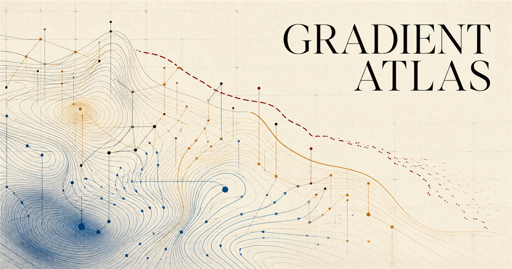

# Gradient Atlas



**A source-traceable course that teaches the machinery of AI and marks the edge of the evidence.**

Gradient Atlas moves from probability and gradient descent to post-training, world models, evaluation, and open research. It does not flatten that path into a list of model names. Each advanced claim carries a status, date, scope, caveat, and source.

The site contains:

- 22 chapter-length lessons across five levels, from AI 101 to a research practicum
- three deep-dive sections and medium, hard, and challenging practice in every chapter
- six interactive labs for gradients, geometry, attention, returns, search, and benchmark uncertainty
- a 22-claim audit that separates useful intuition from technical error
- 75 books, papers, courses, reports, and official research pages
- a dated atlas of six emerging research programs, including explicit gaps where public evidence is thin
- local-only lesson progress, with no account or analytics layer

## The central idea

Frontier claims expire quickly. Stable mechanisms should not. Gradient Atlas keeps those two kinds of knowledge apart: foundational lessons explain what can be derived, while frontier pages state what was public on a specific date and what remains an inference.

## Run it locally

Requirements: Node.js 22.13 or newer.

```bash
npm install
npm run dev
```

The development server opens at `http://localhost:3000`.

## Verification

```bash
npm run verify
```

That command runs deterministic simulation tests, content-contract checks, TypeScript, ESLint, a production build, rendered-output checks, and Playwright across every route. The five top-level routes run at 320, 768, 1024, and 1440 pixels; every lesson receives an additional desktop pass. Focused checks cover keyboard operation, reduced motion, mobile control size, console errors, overflow, and serious or critical accessibility violations.

Individual gates are also available:

```bash
npm run test:unit
npm run verify:content
npm run typecheck
npm run lint
npm run build
npm run test:rendered
npm run test:e2e
```

## Evidence rules

Mechanism claims prefer primary papers and established textbooks. Claims about current systems use first-party technical reports or official research pages, dated at the point of verification. Research-company pages with little technical disclosure are treated as statements of intent, not results.

The source policy is documented in [`docs/SOURCE_POLICY.md`](docs/SOURCE_POLICY.md). The curriculum and its depth contract live in [`docs/CURRICULUM.md`](docs/CURRICULUM.md).

## Project structure

```text
app/          routes and metadata
components/   editorial UI and interactive labs
content/      typed lessons, claim records, programs, and sources
lib/          pure simulations and content validation
tests/        deterministic and rendered-output tests
e2e/          route, interaction, responsive, and accessibility tests
docs/         curriculum, specification, and evidence policy
```

## Known limits

- The frontier snapshot is dated 2026-08-15. It is designed to be revised, not treated as permanent fact.
- Lesson completion is stored in the current browser only.
- The labs isolate one mechanism at a time. They are explanations, not replicas of full training systems.
- The application uses a beta release of vinext, so framework compatibility remains a release risk. The full dependency tree currently audits cleanly.

## License

Code and original visual assets are available under the [MIT License](LICENSE). Book excerpts and third-party sources are not redistributed; the site paraphrases and links to them.
